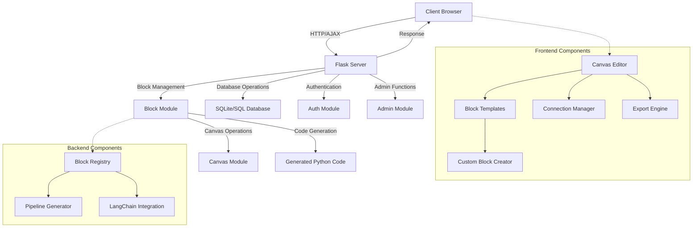

# RAGgie: Retrieval Augmented Generation Pipeline Builder


RAGgie is a powerful, user-friendly web application for creating, testing, and exporting Retrieval Augmented Generation (RAG) pipelines. It provides a visual block-based interface where users can connect various LLM components to build custom RAG workflows without writing code.

## Table of Contents

- [Overview](#overview)
- [Features](#features)
- [Architecture](#architecture)
- [Installation](#installation)
- [Getting Started](#getting-started)
- [Usage Guide](#usage-guide)
- [Custom Block Creation](#custom-block-creation)
- [Templates](#templates)
- [Exporting Pipelines](#exporting-pipelines)
- [Customization](#customization)
- [Security and Authentication](#security-and-authentication)
- [Deployment](#deployment)
- [Docker](#docker)
- [Troubleshooting](#troubleshooting)
- [Contributing](#contributing)
- [License](#license)

## Overview

RAGgie simplifies the process of building Retrieval Augmented Generation (RAG) pipelines by providing a visual interface where users can:

1. Add blocks representing different LLM components (document loaders, text splitters, embeddings, etc.)
2. Connect these blocks to create a functional pipeline
3. Configure each block with custom parameters
4. Export the pipeline as a standalone Python script

The application is built with Flask on the backend and vanilla JavaScript on the frontend, making it lightweight and easy to deploy.

## Features

- **Visual Block Editor**: Drag-and-drop interface for creating pipelines
- **Custom Block Creation**: Create reusable blocks from LangChain components
- **Live Testing**: Test your pipeline components directly in the browser
- **Python Export**: Export your pipeline as a Python script with all dependencies
- **Template System**: Save and load pipeline templates for quick reuse
- **Dark/Light Modes**: Switch between dark and light themes
- **Canvas Customization**: Change background colors and layout
- **Admin Panel**: Secure user management and system settings
- **Authentication**: User registration, login, and password reset functionality
- **Public/Private Mode**: Toggle between requiring login or allowing public access

## Architecture



## Installation

### Prerequisites

- Python 3.7+ 
- pip (Python package manager)
- Git (optional, for cloning the repository)

### Step 1: Clone the Repository

```bash
git clone https://github.com/Ekorz-boop/pa1475_LLM.git
cd pa1475_LLM
```

Or download and extract the ZIP file from the repository.

### Step 2: Install Dependencies

```bash
pip install -r requirements.txt
```

### Step 3: Configure Environment Variables (Optional)

For production use, create a `.env` file in the root directory with the following variables:

```env
SECRET_KEY=your-secret-key
DATABASE_URL=sqlite:///app.db  # Or your preferred database URI
MAIL_SERVER=smtp.gmail.com
MAIL_PORT=587
MAIL_USE_TLS=True
MAIL_USERNAME=your_email@gmail.com
MAIL_PASSWORD=your_gmail_app_password
MAIL_DEFAULT_SENDER=your_email@gmail.com
```

> **Note:** For Gmail, you must use an [App Password](https://support.google.com/accounts/answer/185833?hl=en) if 2FA is enabled.

### Step 4: Initialize the Database

```bash
python init_db.py
```

This creates the database and an initial admin user:
- **Username:** `admin`
- **Password:** `admin123`

### Step 5: Run the Application

```bash
python server.py
```

Visit [http://127.0.0.1:5000](http://127.0.0.1:5000) in your browser.

## Getting Started

### First Login

1. Navigate to [http://127.0.0.1:5000](http://127.0.0.1:5000)
2. Log in with the default admin credentials:
   - Username: `admin`
   - Password: `admin123`
3. Change the default password immediately after login

### Creating Your First Pipeline

1. Navigate to the main canvas view
2. Click "Create Custom Block" in the sidebar
3. Search for a component (e.g., "PyPDFLoader")
4. Configure the block settings and add it to the canvas
5. Add more blocks and connect them by dragging from output nodes to input nodes
6. Test your pipeline by running individual blocks
7. Export your complete pipeline when finished

## Usage Guide

### Block Management

RAGgie's main interface is a canvas where you create and connect blocks:

1. **Adding Blocks**: Use the sidebar to create custom blocks from LangChain components
2. **Moving Blocks**: Drag blocks to reposition them on the canvas
3. **Connecting Blocks**: Click and drag from an output node to an input node
4. **Configuring Blocks**: Click a block to access its configuration panel
5. **Deleting Blocks**: Right-click a block and select "Delete" or press Delete key when selected

### Block Types and Components

RAGgie supports various LangChain components that can be added as blocks:

- **Document Loaders**: PyPDFLoader, DirectoryLoader, WebBaseLoader, etc.
- **Text Splitters**: RecursiveCharacterTextSplitter, TokenTextSplitter, etc.
- **Embeddings**: OpenAIEmbeddings, HuggingFaceEmbeddings, etc.
- **Vector Stores**: FAISS, Chroma, etc.
- **Retrievers**: Custom retrievers with various search strategies
- **Language Models**: ChatOpenAI, LLaMA, etc.
- **Chains**: Custom chains for question answering, summarization, etc.

### Canvas Navigation

- **Pan**: Hold spacebar or middle mouse button and drag
- **Zoom**: Use mouse wheel or pinch gestures
- **Fit to View**: Click the fit-to-view button to center all blocks in view
- **Mini-map**: Use the mini-map in the bottom-right corner for quick navigation

## Custom Block Creation

Creating custom blocks is at the heart of RAGgie:

1. Click "Create Custom Block" in the sidebar
2. Search for a LangChain component (e.g., "PyPDFLoader")
3. Review the component details and documentation
4. Select methods you want to include in your block
5. Configure default parameters
6. Add the block to your canvas

## Templates

Save your pipelines as templates for future use:

### Saving Templates

1. Create your pipeline on the canvas
2. Click the "Save Template" button in the Templates sidebar
3. Enter a name and description for your template
4. Click "Save"

### Loading Templates

1. Click the "Templates" button in the sidebar
2. Browse your saved templates
3. Click a template to load it to the canvas

## Exporting Pipelines

Convert your visual pipeline into a runnable Python script:

1. Build your complete pipeline on the canvas
2. Click the "Export Pipeline" button 
3. Review the generated Python code
4. Download the code as a `.py` file
5. Run it with `python generated_pipeline.py`

The exported code includes:

- All necessary imports
- Component initialization with your configurations
- Connection logic between components
- Basic error handling and file operations

## Customization

### Theme Settings

RAGgie offers the following customization options:

1. **Theme Modes**:
   - Light Mode
   - Dark Mode
   - System (follows OS settings)

2. **Canvas Background**:
   - Default
   - White
   - Light Blue
   - Light Yellow
   - Light Green
   - Light Purple

### Advanced Configuration

For advanced users, RAGgie can be customized further:

- **CSS Styling**: Modify CSS files in the `/static/css` directory
- **New Components**: Update server.py to support additional LangChain components
- **Custom Templates**: Create predefined templates in the database

## Security and Authentication

RAGgie includes a full authentication system with the following features:

- **User Registration**: New users can register with email and password
- **Login System**: Secure login with session management
- **Password Reset**: Email-based password reset functionality
- **Role-based Access**: Admin and regular user roles
- **Public Mode**: Option to make the main site public (no login required)

> **Note**: Admin features are always protected regardless of public mode settings.

For a complete guide to the authentication and admin system, see [README-admin-auth.md](README-admin-auth.md).

## Deployment

### Production Deployment

For production deployment, consider the following steps:

1. **Use a Production WSGI Server**:
   ```bash
   pip install gunicorn
   gunicorn -w 4 -b 0.0.0.0:8000 server:app
   ```

2. **Set Environment Variables**:
   - Set `SECRET_KEY` to a secure random string
   - Configure proper database credentials
   - Set up mail server settings for password resets

3. **Configure a Reverse Proxy**:
   - Use Nginx or Apache as a reverse proxy
   - Configure SSL/TLS for secure HTTPS connections

4. **Database Considerations**:
   - For larger deployments, migrate from SQLite to PostgreSQL/MySQL
   - Set up database backups

## Docker

You can also build and run RAGgie using Docker.

### Prerequisites

- [Docker](https://docs.docker.com/get-docker/) installed on your system.

### Building the Docker Image

1.  **Clone the repository** (if you haven't already):
    ```bash
    git clone https://github.com/Ekorz-boop/pa1475_LLM.git
    cd pa1475_LLM
    ```

2.  **Build the Docker image**:
    From the root directory of the project (where the `Dockerfile` is located), run:
    ```bash
    docker build -t raggie-app .
    ```

### Running the Docker Container

1.  **Run the container**:
    ```bash
    docker run -d -p 5000:5000 --name raggie-container raggie-app
    ```
    - `-d`: Runs the container in detached mode (in the background).
    - `-p 5000:5000`: Maps port 5000 of the host to port 5000 in the container.
    - `--name raggie-container`: Assigns a name to the container for easier management.
    - `raggie-app`: The name of the image you built.

2.  **Access the application**:
    Open your browser and go to `http://localhost:5000`.

### Environment Variables

For a production setup, or if you need to configure mail settings, you should pass environment variables to the `docker run` command.

**Example with `SECRET_KEY` and mail settings:**
```bash
docker run -d \\
  -p 5000:5000 \\
  --name raggie-container \\
  -e SECRET_KEY='your_very_secure_and_long_secret_key' \\
  -e MAIL_SERVER='smtp.example.com' \\
  -e MAIL_PORT=587 \\
  -e MAIL_USE_TLS=True \\
  -e MAIL_USERNAME='your_email@example.com' \\
  -e MAIL_PASSWORD='your_email_password' \\
  -e MAIL_DEFAULT_SENDER='noreply@example.com' \\
  raggie-app
```
Refer to the "Configure Environment Variables" section under "Installation" for details on these variables.

### Data Persistence

-   **Database (`instance/app.db`)**: The default Docker setup will initialize a new SQLite database inside the `instance/` directory within the container each time it starts (as `init_db.py` is run). To persist your database across container restarts, you should use a Docker volume:
    ```bash
    docker volume create raggie-data
    docker run -d \\
      -p 5000:5000 \\
      --name raggie-container \\
      -v raggie-data:/app/instance \\
      # Add your -e environment variables here
      raggie-app
    ```
    When using a volume for the first time, the `init_db.py` script in the `CMD` will create the database. For subsequent runs, it will use the existing database in the volume. You might want to adjust `init_db.py` or the `Dockerfile` `CMD` if you have specific needs for managing an existing database in a volume.

-   **User Files (`files/`)**: The `files/` directory (used for uploads, etc.) is part of the container. If you need data in this directory to persist or be shared, consider mounting a volume for it as well:
    ```bash
    docker volume create raggie-files
    docker run -d \\
      -p 5000:5000 \\
      --name raggie-container \\
      -v raggie-data:/app/instance \\
      -v raggie-files:/app/files \\
      # Add your -e environment variables here
      raggie-app
    ```

## Troubleshooting

### Common Issues

1. **Block Connections Not Working**:
   - Ensure the output and input types are compatible
   - Check that you're connecting to a valid input node

2. **Export Not Working**:
   - Verify all blocks are properly connected
   - Check for cycles in your pipeline

3. **Email Features Not Working**:
   - Verify your SMTP settings
   - For Gmail, ensure you're using an App Password

### Logs

Check for errors in the terminal where the server is running. For detailed logs:

```bash
python server.py > raggie.log 2>&1
```

## Contributing

Contributions are welcome! To contribute:

1. Fork the repository
2. Create a feature branch: `git checkout -b new-feature`
3. Make your changes
4. Run tests (if available)
5. Commit your changes: `git commit -m 'Add new feature'`
6. Push to the branch: `git push origin new-feature`
7. Submit a pull request

## License

This project is licensed under the MIT License - see the [LICENSE](LICENSE) file for details.